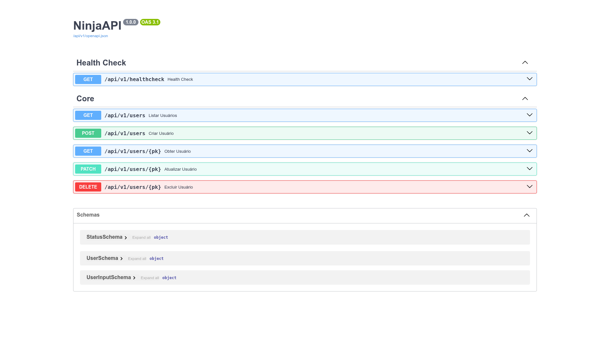

# copier-django-template

**English 🇺🇸 | Português 🇧🇷**

## 🇺🇸 About

This project is a reusable [Copier](https://copier.readthedocs.io/) template for bootstrapping Django applications quickly and consistently. It includes a pre-configured Django project with:

- Django 5.2+
- Django Ninja 1.4+ (API)
- Environment variables using `python-decouple`

Use this template to save time setting up new Django projects, especially when working with APIs using Django Ninja.

---

## 🇺🇸 Getting Started

### 1. Create your project folder and copier folder

```bash
mkdir -p ~/projects/django_ninja_example
mkdir -p ~/projects/copier_tmp
````

### 2. Generate your project using Copier

```bash
cd ~/projects/copier_tmp

python -m venv .venv
source .venv/bin/activate

pip install copier

copier copy https://github.com/rg3915/copier-django-template.git ~/projects/django_ninja_example
```

### Result

```
.
├── apps
│   ├── api.py
│   ├── asgi.py
│   ├── core
│   │   ├── api.py
│   │   ├── apps.py
│   │   ├── __init__.py
│   │   └── schemas.py
│   ├── __init__.py
│   ├── settings.py
│   ├── urls.py
│   └── wsgi.py
├── env.sample
├── manage.py
├── README.md
└── requirements.txt
```

### 3. How to run the new project

```bash
deactivate  # deactivate copier venv

cd ~/projects/django_ninja_example

python -m venv .venv
source .venv/bin/activate

pip install -r requirements.txt

cp env.sample .env
```

### 4. Run migrations and create a superuser

```bash
python manage.py migrate
python manage.py createsuperuser --username="admin" --email=""
```

### 5. Start the development server

```bash
python manage.py runserver
```

### Docs

Enter in

http://localhost:8000/api/v1/docs



### Plus

If you want to run everything on Linux with a script, type

```bash
wget https://gist.githubusercontent.com/rg3915/7842b05ff93d9fd87f977d3c0b9300d3/raw/6dea5f85478bc582b86121f2bd8b79aab6518215/script.sh

source script.sh
```


---

## 🇧🇷 Sobre

Este projeto é um template reutilizável do [Copier](https://copier.readthedocs.io/) para iniciar aplicações Django de forma rápida e padronizada. Ele já vem com uma estrutura pronta contendo:

* Django 5.2+
* Django Ninja 1.4+ (para APIs)
* Variáveis de ambiente com `python-decouple`

Ideal para quem deseja agilidade na criação de projetos Django com suporte a APIs.

---

## 🇧🇷 Como começar

### 1. Crie a pasta do seu projeto e a pasta do copier

```bash
mkdir -p ~/projects/django_ninja_example
mkdir -p ~/projects/copier_tmp
````

### 2. Gere seu projeto com o Copier

```bash
cd ~/projects/copier_tmp

python -m venv .venv
source .venv/bin/activate

pip install copier

copier copy https://github.com/rg3915/copier-django-template.git ~/projects/django_ninja_example
```

### Resultado

```
.
├── apps
│   ├── api.py
│   ├── asgi.py
│   ├── core
│   │   ├── api.py
│   │   ├── apps.py
│   │   ├── __init__.py
│   │   └── schemas.py
│   ├── __init__.py
│   ├── settings.py
│   ├── urls.py
│   └── wsgi.py
├── env.sample
├── manage.py
├── README.md
└── requirements.txt
```

### 3. Como rodar o novo projeto

```bash
deactivate  # desative a venv do copier

cd ~/projects/django_ninja_example

python -m venv .venv
source .venv/bin/activate

pip install -r requirements.txt

cp env.sample .env
```

### 4. Rode as migrações e crie um superusuário

```bash
python manage.py migrate
python manage.py createsuperuser --username="admin" --email=""
```

### 5. Inicie o servidor de desenvolvimento

```bash
python manage.py runserver
```

### Docs

Entre em

http://localhost:8000/api/v1/docs


### Plus

Se quiser rodar tudo no Linux com um script, digite

```bash
wget https://gist.githubusercontent.com/rg3915/7842b05ff93d9fd87f977d3c0b9300d3/raw/6dea5f85478bc582b86121f2bd8b79aab6518215/script.sh

source script.sh
```

